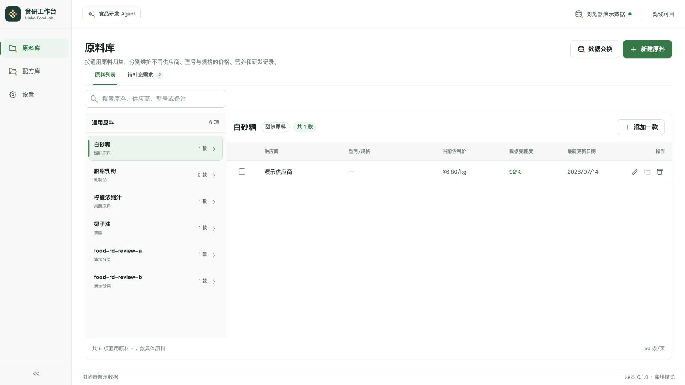
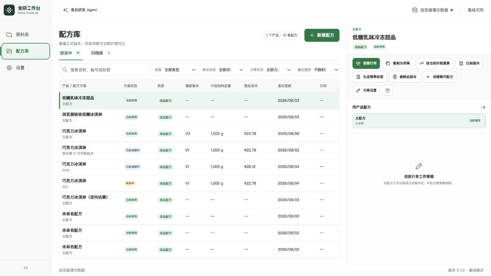
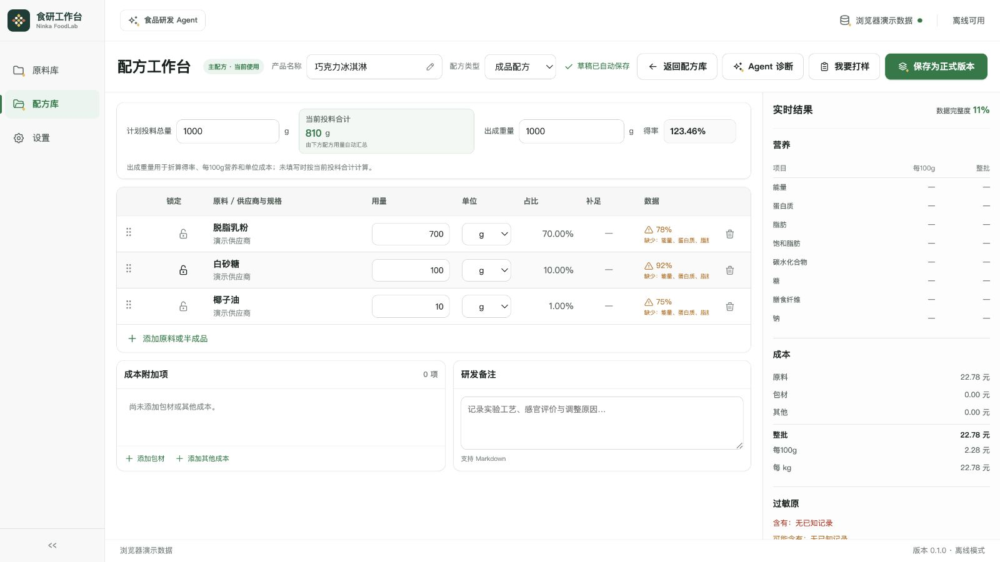
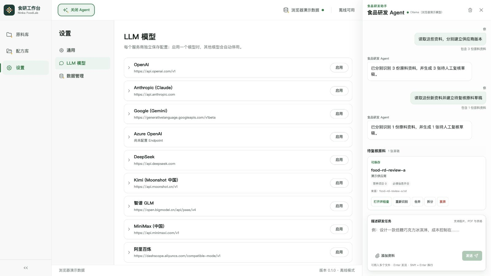

<p align="center">
  
</p>

# Ninka FoodLab

面向食品研发人员的开源、离线优先桌面应用。它把原料与供应商版本、配方设计、营养与成本试算、打样配料单、版本归档、标签预览、研发报告和受控 Agent 放在同一个本地工作台中。

> 当前版本：`0.2.0` 内测版。macOS Apple Silicon 安装包已完成本机验证；Intel Mac 包和 Windows x64 包由对应架构的构建环境生成，仍需要在真实设备上完成试装验收。当前 macOS 与 Windows 安装包都没有付费开发者证书签名，只用于内部测试。

## 为什么做这个项目

食品研发的数据往往散落在供应商资料、Excel、照片和不同版本的配方中。Ninka FoodLab 希望提供一个可以追溯、可以复算、默认不把配方上传到云端的基础工具，并让 AI 只能提出草稿和建议，不能绕过人工确认直接修改正式数据。中文界面中的“食研工作台”作为产品用途说明保留。

## 已有能力

- **原料库**：按通用原料归类，分别维护不同供应商、型号和规格的价格、营养、密度与研发备注。
- **配方研发**：选择明确的供应商原料或正式半成品版本，实时估算投料、出成重量、得率、营养、成本与数据完整度。
- **版本管理**：研发中、正式版本、替代配方、归档和恢复；历史快照不会被后续改价覆盖。
- **我要打样**：按期望出成量或计划投料量生成配料清单，支持打印和 Excel 导出。
- **营养标签与报告**：支持 GB 28050-2011 / 2025 规则包、研发报告和多种离线导出格式。
- **本地备份**：创建并预检 `.foodrd-backup`，恢复前自动保护当前状态，失败时原子回滚。
- **Ninka Agent**：支持 API 模型；可以辅助原料资料识别、配方提案和标签逆向，但正式写入必须人工复核。

未知营养值不会被当作零。应用中的营养、标签和法规输出是研发估算与风险提示，不是检测报告，也不替代正式标签合规审核。

## 界面预览

### 原料库



### 配方库与配方工作台





### Ninka Agent



## 从源码运行

### 环境要求

- Node.js `>=24.14.0 <25`
- pnpm `11.7.0`
- Rust stable（运行桌面版时需要）
- macOS 或 Windows；浏览器演示模式也可用于前端开发

如果系统没有 pnpm，可以先执行：

```bash
npm install --global pnpm@11.7.0
```

下载或克隆源码后，在仓库根目录执行：

```bash
pnpm install --frozen-lockfile
pnpm dev:desktop
```

然后访问 `http://127.0.0.1:1420/`。这是浏览器演示模式，数据保存在当前浏览器，不代表完整的 Tauri/SQLite 桌面行为。

运行桌面版：

```bash
pnpm tauri:dev
```

详细环境说明、常见数据目录和打包命令见[桌面端开发说明](apps/desktop/README.md)与[桌面发布说明](docs/desktop-release.md)。

## 数据与隐私

- 桌面业务数据默认保存在本机 SQLite；当前不提供云同步。
- API Key 由操作系统安全凭据存储管理，不进入 SQLite、日志或备份。
- `.foodrd-backup` 有完整性校验，但**没有加密或数字签名**，不要上传真实研发备份到公开仓库。
- 只有启用远程模型并确认发送范围后，当前任务所需资料才会发送给模型服务商。

详见[开源版数据安全说明](docs/data-safety.md)和[备份格式](docs/backup-format.md)。

## 开发与验证

```bash
pnpm typecheck
pnpm test
pnpm build
cargo fmt --manifest-path apps/desktop/src-tauri/Cargo.toml --check
cargo clippy --manifest-path apps/desktop/src-tauri/Cargo.toml --all-targets -- -D warnings
cargo test --manifest-path apps/desktop/src-tauri/Cargo.toml --all-targets
```

修改品牌资源时，还需要按[品牌资产说明](assets/branding/README.md)创建 Python 环境并运行 `pnpm brand:verify`。

## 参与贡献

欢迎提交可复现的缺陷报告、食品研发场景和代码改进。请先阅读[贡献指南](CONTRIBUTING.md)与[安全报告说明](SECURITY.md)。当前路线与已验证范围见[开发路线图](docs/roadmap.md)。

维护者第一次配置公开仓库和首个版本时，请按[GitHub 开源上线步骤](docs/github-publishing.md)逐项执行，不要把本地文件准备误认为已经对外发布。

## 许可证

项目代码和未单独声明的项目资产采用 [Apache License 2.0](LICENSE)。品牌源字体使用其目录中的 SIL Open Font License。第三方依赖仍遵循各自许可证，当前声明清单见[第三方许可证清单](THIRD_PARTY_LICENSES.md)。

Copyright 2026 Ninka FoodLab.
