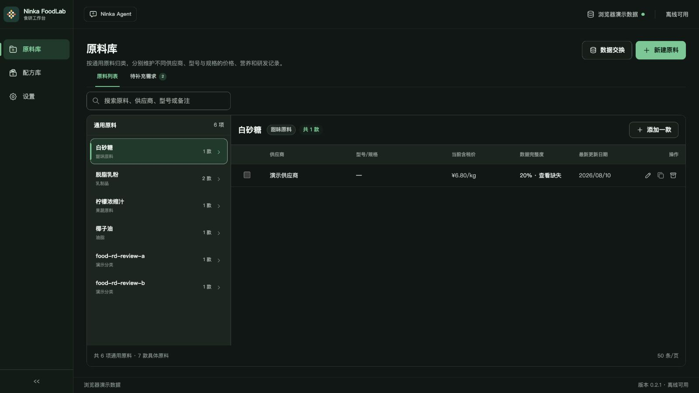
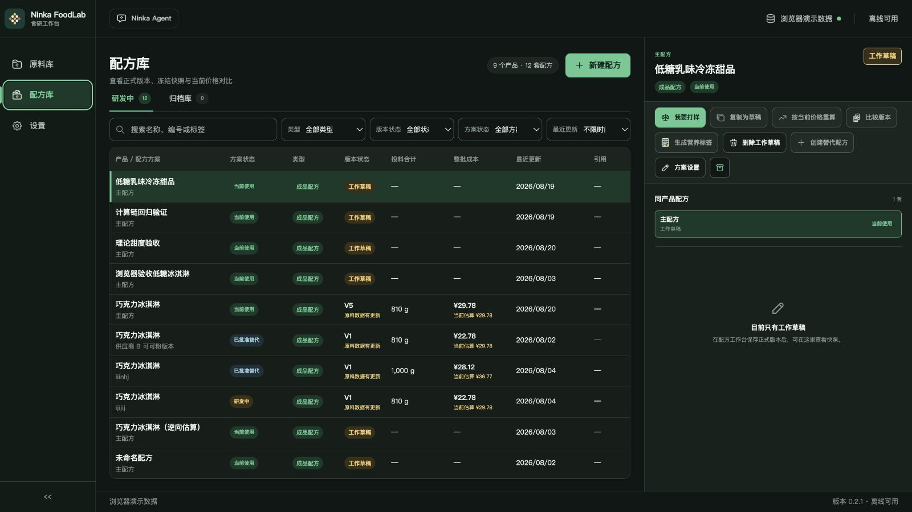
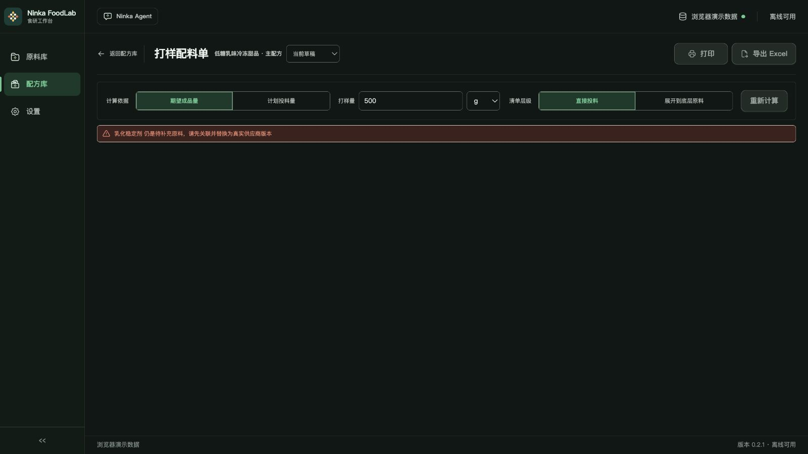
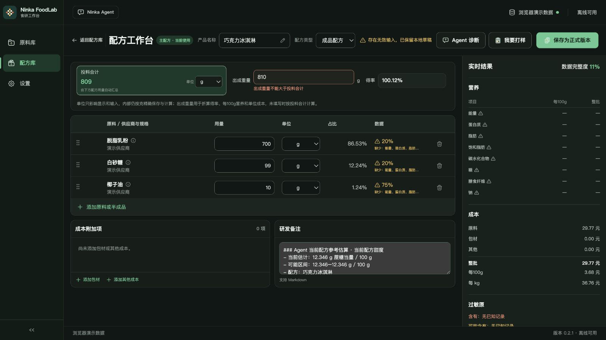
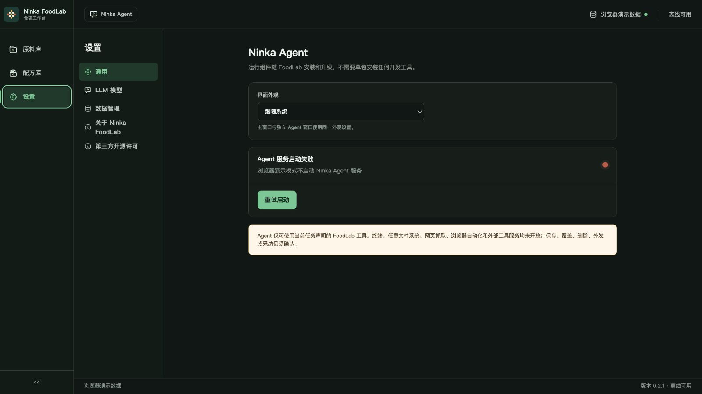
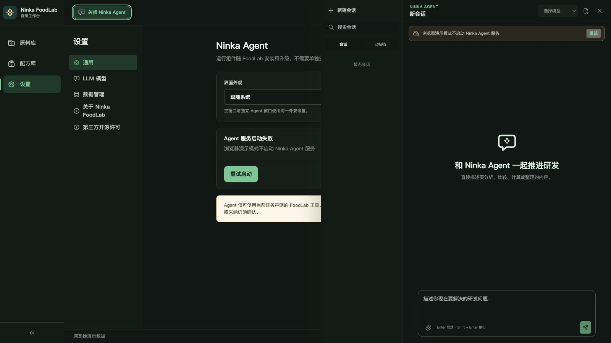
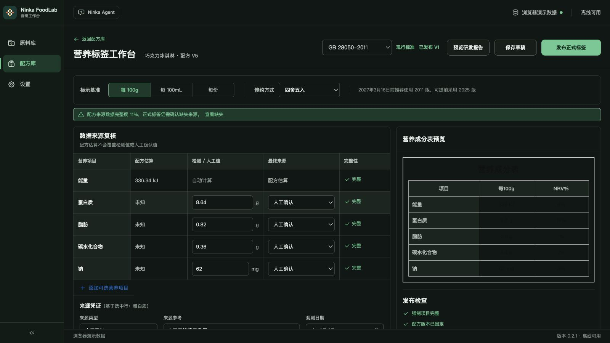

# Ninka FoodLab UI/UX 审计

- 日期：2026-08-29
- 范围：原料库、配方库、打样配料单、配方工作台、设置、Ninka Agent、营养标签工作台
- 目标：在保留现有品牌、业务逻辑与数据安全边界的前提下，重新组织信息层级、页面构图和核心操作路径
- 审计环境：浏览器演示数据，深色主题，默认桌面窗口

## 总体判断

现有界面已经形成统一的深森林绿品牌语言，导航、按钮、表格和状态组件也具备一致性。主要问题不是“样式不好看”，而是复杂功能不断叠加后，页面层级开始依赖边框、色块和横向铺排；核心操作、异常状态和辅助信息经常同时争夺注意力。

建议保留品牌色、左侧全局导航、表格型专业工具气质和现有业务术语，重点重构页面结构、操作优先级、详情面板和异常恢复路径。

## 审计步骤

### 1. 原料库 — 一般

优点：全局导航清楚；通用原料与供应商规格使用主从结构，用户容易理解；选中状态明确。

主要问题：左侧原料列表偏窄，右侧仅一条数据时出现大面积空白；搜索、列表和详情的宽度比例没有随内容变化；页面主要依靠多层边框分区，视觉层级偏平。

可访问性风险：次级文字和绿色状态文字在深色背景上偏弱；表格末端的编辑、复制、归档为图标按钮，识别和点击目标都偏小。截图不能确认键盘焦点是否清楚。

### 2. 配方库 — 需优化

优点：配方状态、方案状态、版本和成本能在一屏内对比；右侧详情保留上下文，适合专业用户连续查看。

主要问题：搜索与四个筛选器同一层级，缺少主次；点击整行打开详情、点击名称进入工作台，两种行为在视觉上没有明显区分；右侧详情打开后压缩主表，信息密度过高；大量不可用按钮仍占据显著位置。

可访问性风险：表格、标签和辅助说明字号偏小；状态主要通过低饱和色区分；窄窗口下的横向滚动、焦点顺序和表格读屏体验仍需实际测试。

### 3. 打样配料单 — 较差

优点：计算依据、打样量、清单层级按操作顺序集中在顶部，基本逻辑清楚。

主要问题：缺少原料映射后，页面只剩一条错误提示和大面积空白，用户不知道下一步应去哪里修复；打印、导出和重新计算仍占据主操作位置，但均不可用；缺少带路径的恢复动作，例如“去关联原料”。

可访问性风险：错误提示已使用 alert 语义，但文字较小，颜色对比需要测量；禁用按钮与普通按钮的差异主要依赖灰度。

### 4. 配方工作台 — 较差

优点：投料、出成、得率、营养、成本与过敏原能够同步查看；数据缺失和无效输入均有提示；核心研发信息齐全。

主要问题：顶部同时承担返回、名称编辑、类型、错误提示、Agent、打样和正式保存，信息竞争最严重；存在无效输入时，“保存为正式版本”仍是最醒目的按钮；主体将批次、原料表、成本附加、备注和实时结果全部同时展开，缺少明确的任务阶段；右侧结果栏固定占宽，压缩了最常编辑的配方表。

可访问性风险：拖拽排序与删除依赖图标，键盘替代方式未验证；黄色、红色提示文字较小；输入框虽然有可访问名称，但错误与对应字段的程序化关联仍需代码级检查。

### 5. 设置 — 一般

优点：二级导航清楚；单项设置分组明确；错误状态同时有文字和颜色，不只依赖红点。

主要问题：全局导航加设置导航形成双侧栏，主内容却只占中间一小块，右侧空白过多；安全说明使用高亮浅色块，视觉强度超过实际设置内容；单一外观设置被包在多个大容器中，空间效率低。

可访问性风险：长段安全说明字号较小、行长偏长；需验证二级导航的焦点状态和当前项播报。

### 6. Ninka Agent 面板 — 需优化

优点：会话列表、主对话和输入区结构完整；空状态能解释 Agent 的用途；与主应用保持同一品牌语言。

主要问题：面板打开后形成全局导航、设置导航、会话导航、对话面板四层纵向结构；底层设置页被硬切断，仍有大量不可用背景信息；顶部“关闭 Ninka Agent”和面板内关闭按钮重复；服务不可用时输入区仍保持接近可用状态的视觉形式。

可访问性风险：禁用模型选择、输入框和发送按钮对比度偏低；部分顶部操作只有图标；打开面板后的焦点约束和 Esc 关闭行为未验证。

### 7. 营养标签工作台 — 存在严重显示问题

优点：数据来源复核与最终标签预览并排，符合“可追溯、可确认”的业务需求；标准、基准、修约和发布检查均可见。

主要问题：顶部同时出现标准选择、状态、报告、草稿与发布操作，正式发布过早成为最强视觉焦点；复核表单和预览区同时高密度展开；缺失来源提示为绿色信息条，与风险性质不匹配。

严重问题：深色主题下，营养成分表预览的标题和数值接近黑色，几乎无法阅读。这是当前最明确的可访问性和视觉缺陷，应优先修复。

### 8. 研发报告预览 — 阻断

从营养标签页点击“预览研发报告”后，应用主界面变为空白。当前运行记录显示报告预览因“营养标签版本与配方版本不一致”抛错，且页面没有错误兜底界面。

这不是单纯的视觉问题，而是核心流程中断。重构时应增加错误边界和可返回的错误页面，避免一次数据不一致导致整个窗口空白。

## 重构优先级

1. **P0：修复营养标签深色主题可读性与研发报告空白页。**
2. **P1：重构配方工作台。** 将“编辑配方”“查看结果”“补全数据”“保存版本”组织为清晰阶段，异常时降低正式保存的视觉优先级。
3. **P1：重构配方库主表与详情面板。** 明确“选中查看”和“进入编辑”的交互差异，减少同时出现的操作。
4. **P1：为打样阻断状态提供直接恢复路径。** 错误状态应包含问题对象、影响和下一步按钮。
5. **P2：统一页面宽度、空白使用和分区方式。** 少用层层卡片与边框，更多依靠间距、对齐和排版层级。
6. **P2：整理 Agent 与设置布局。** 减少纵向导航层数，明确面板打开后的主次关系。

## 建议的整体重构原则

- 保留深森林绿、薄荷绿主按钮、现有 Logo 和专业表格气质。
- 每个页面只保留一个明确的主操作；不可用操作折叠到更多菜单或在满足条件后出现。
- 用任务阶段组织复杂页面，而不是把所有模块同时铺开。
- 将数据完整度、错误和发布条件放到与主操作直接关联的位置。
- 主表优先保证可读宽度；详情可使用可调节抽屉、整页详情或分栏切换。
- 深色、浅色和窄窗口均纳入实现后的视觉回归检查。

## 证据范围与限制

- 本轮基于浏览器演示数据和深色主题截图。
- 未验证真实 Tauri 桌面窗口的系统标题栏、缩放、高 DPI 和平台差异。
- 较窄窗口截图工具出现画布比例异常，因此未作为审计证据；响应式结论仍需后续实机验证。
- 截图和 DOM 结构无法证明完整的 WCAG 合规性；键盘、读屏、焦点、对比度数值和缩放仍需专项测试。
- 浏览器演示模式不启动真实 Agent 服务，因此未审计完整对话过程。
