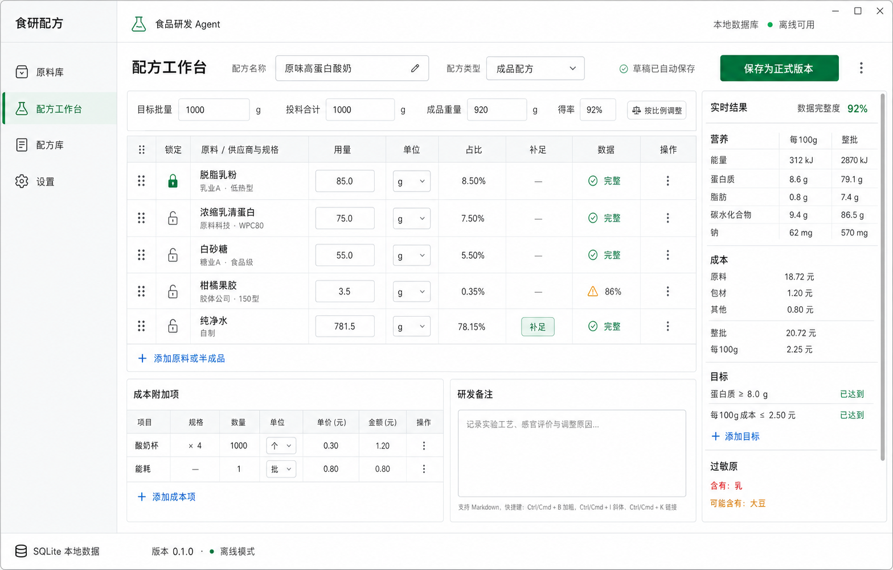
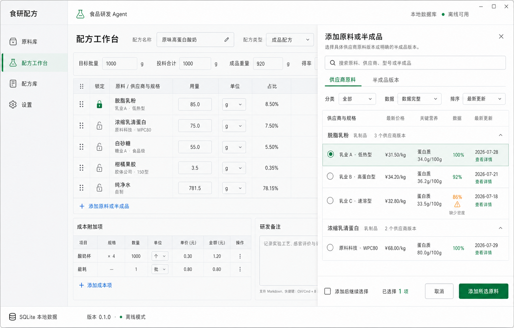
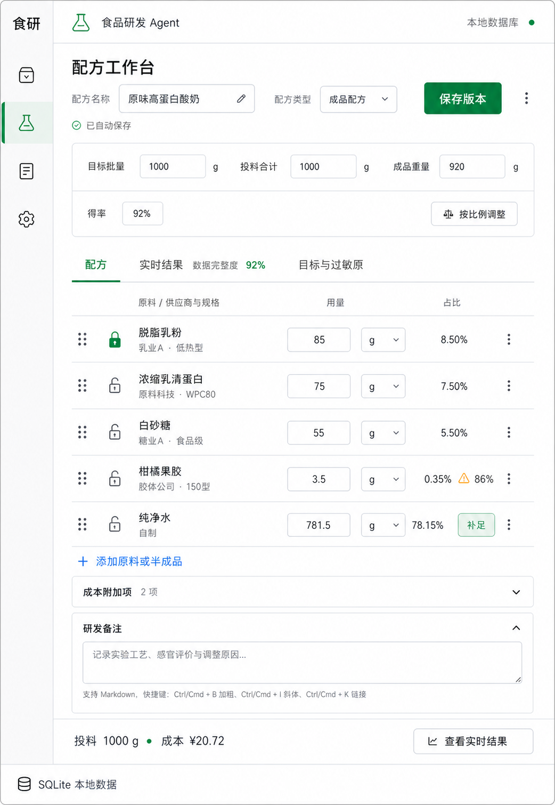

# 配方工作台设计规格

状态：第四阶段实现基准  
适用范围：Task 7–Task 9  
设计方向：白色 / 浅灰 / 绿色的桌面研发工具，表格与检查器主导

## 1. 设计基准

### 桌面主工作台

- 原始尺寸：1568 × 1003
- 用途：宽屏工作台、表格、批量控制、成本、备注、实时结果
- 实现时以本规格中的数据和文案为准；图片用于布局、密度、层级和视觉风格比对。

### 原料选择状态

- 原始尺寸：1568 × 1003
- 用途：选择具体供应商原料版本或明确半成品版本
- 抽屉宽度：桌面端 620–680px

### 窄屏工作台

- 原始尺寸：1042 × 1510
- 用途：窄窗口下的导航、配方列表、折叠区和结果入口
- 窄屏不保留右侧检查器；结果改为独立视图。

## 2. 产品原则

1. 这是食品研发编辑器，不是经营仪表盘。
2. 原料表是主任务面，实时结果是辅助检查面。
3. 每一行必须指向具体供应商原料版本或明确半成品版本。
4. 用量、占比、锁定、补足和数据问题必须在原料行附近可见。
5. 研发记录只使用一个 Markdown 备注框，不拆分实验工艺或感官评价模块。
6. 保留现有左侧导航、顶部状态栏、底部状态栏和 Agent 入口。
7. 不加入营销区、照片、装饰插画、图表、KPI 卡、团队头像或云协作元素。

## 3. 色彩锁定

背景必须是纯白和冷浅灰，不得改成米白、奶油色或暖灰。

| Token | 值 | 用途 |
| --- | --- | --- |
| `--color-canvas` | `#ffffff` | 主背景、输入框、抽屉 |
| `--color-sidebar` | `#f6f8f7` | 左侧导航 |
| `--color-table-header` | `#f5f7f6` | 表头 |
| `--color-surface-muted` | `#f8faf9` | 次级背景、悬停 |
| `--color-ink` | `#17211c` | 主要文字 |
| `--color-ink-soft` | `#4f5d55` | 次级文字 |
| `--color-ink-muted` | `#78837d` | 辅助文字 |
| `--color-border` | `#d9e0dc` | 普通分隔线 |
| `--color-border-strong` | `#c4cec8` | 输入框、强调边界 |
| `--color-accent` | `#087a43` | 主按钮、选中态 |
| `--color-accent-hover` | `#066b3a` | 主按钮悬停 |
| `--color-accent-soft` | `#e9f4ee` | 选中行、选中导航 |
| `--color-warning` | `#b96a05` | 缺失数据、可能含有 |
| `--color-danger` | `#b42318` | 错误、含有过敏原 |
| `--color-focus` | `#0b8350` | 键盘焦点 |

语义色只用于状态文字和小图标。除主操作外，不用大面积绿色填充。

## 4. 字体和密度

- 字体：`"SF Pro Text", "PingFang SC", "Microsoft YaHei UI", system-ui, sans-serif`
- 页面标题：24px / 1.25 / 680
- 区域标题：16px / 1.35 / 650
- 表头、标签：12px / 1.4 / 620–650
- 正文、输入、按钮：14px / 1.5 / 480–620
- 辅助文字：12–13px / 1.5 / 480
- 表格行：桌面 54–58px；窄屏 72–78px
- 输入控件：桌面 36–42px；窄屏最小点击高度 40px
- 圆角：输入和按钮 6px；面板 9px；不得把内容区做成大量圆角卡片
- 阴影：仅抽屉和浮层使用；普通编辑区只用边界线

## 5. 宽屏布局

### 应用框架

- 左侧导航：168px
- 顶栏：66px
- 状态栏：36px
- 内容区：`minmax(0, 1fr)`
- Agent 打开时沿用现有 390px 面板，不改变工作台信息架构。

### 工作台内容

- 工作台内部使用两列：
  - 主编辑区：`minmax(720px, 1fr)`
  - 实时结果检查器：340–380px
- 检查器使用左边框，不使用悬浮卡片。
- 主编辑区垂直滚动；检查器单独垂直滚动。
- 顶部标题和批量控制保持可见，表头在编辑区内吸顶。

### 标题区

从左到右：

1. `配方工作台`
2. 标签 `配方名称`
3. 可编辑名称 `原味高蛋白酸奶`
4. 标签 `配方类型`
5. 选择器 `成品配方`
6. 保存状态 `草稿已自动保存`
7. 主操作 `保存为正式版本`
8. 更多操作按钮

状态文案只允许：

- `正在自动保存…`
- `草稿已自动保存`
- `自动保存失败`
- `存在无效输入，已保留本地草稿`

### 批量控制带

使用一条连续的浅边框控制带，不拆成指标卡：

- `计划投料总量` `1000` `g`
- `当前投料合计` `1000` `g`，标注“由下方配方用量自动汇总”
- `出成重量` `920` `g`
- `得率` `92%`

计划投料总量和出成重量是可编辑输入；当前投料合计和得率为计算值。当前投料合计使用独立的浅色只读样式，不呈现为可编辑输入框。

## 6. 配方原料表

### 桌面列

| 列 | 内容 |
| --- | --- |
| 排序 | 六点拖动柄；键盘提供上移/下移替代操作 |
| 锁定 | 锁定/解锁图标按钮 |
| 原料 / 供应商与规格 | 第一行通用名；第二行供应商 · 型号/规格 |
| 用量 | 保留用户原始文本的数字输入 |
| 单位 | `mg` / `g` / `kg` / `mL` / `L` |
| 占比 | 双向联动百分比输入 |
| 补足 | 单选补足项；锁定项不可设为补足 |
| 数据 | 完整度或具体缺失提示 |
| 操作 | 删除、详情和替换入口 |

### 基准行数据

| 原料 | 供应商与规格 | 用量 | 占比 | 状态 |
| --- | --- | ---: | ---: | --- |
| 脱脂乳粉 | 乳业A · 低热型 | 85g | 8.50% | 锁定、完整 |
| 浓缩乳清蛋白 | 原料科技 · WPC80 | 75g | 7.50% | 完整 |
| 白砂糖 | 糖业A · 食品级 | 55g | 5.50% | 完整 |
| 柑橘果胶 | 胶体公司 · 150型 | 3.5g | 0.35% | 数据 86%，琥珀色提示 |
| 纯净水 | 自制 | 781.5g | 78.15% | 补足、完整 |

表格底部操作：`+ 添加原料或半成品`

错误与缺失数据必须显示在对应行；全局错误摘要只能作为补充。

## 7. 成本附加项和研发备注

桌面端在表格下方并列显示，使用边界线分区。

### 成本附加项

列：`项目`、`数量`、`单位`、`单价（元）`、`金额（元）`、`操作`

基准数据：

- 包材：`酸奶杯`，数量 `4`，单位 `个`，单价 `0.30`，金额 `1.20`
- 其他成本：`能耗`，金额 `0.80`

操作：`+ 添加成本项`

设计图中的包材数量显示存在生成误差；实现必须使用上述基准数据。

### 研发备注

- 标题：`研发备注`
- 只提供一个 Markdown 文本框。
- 占位文字：`记录实验工艺、感官评价与调整原因…`
- 辅助文字：`支持 Markdown`
- 不额外增加工艺表、感官评分表或独立记录页。

## 8. 实时结果检查器

检查器按分隔线依次显示，不做多层卡片。

### 实时结果

- 标题：`实时结果`
- `数据完整度 92%`

### 营养

| 项目 | 每100g | 整批 |
| --- | ---: | ---: |
| 能量 | 312kJ | 2870kJ |
| 蛋白质 | 8.6g | 79.1g |
| 脂肪 | 0.8g | 7.4g |
| 碳水化合物 | 9.4g | 86.5g |
| 钠 | 62mg | 570mg |

### 成本

- `原料 18.72元`
- `包材 1.20元`
- `其他 0.80元`
- `整批 20.72元`
- `每100g 2.25元`

### 目标

- `蛋白质 ≥ 8.0g` — `已达到`
- `每100g成本 ≤ 2.50元` — `已达到`
- 操作：`+ 添加目标`

### 过敏原

- `含有：乳` 使用危险色文字。
- `可能含有：大豆` 使用警告色文字。
- 不使用彩色标签云。

## 9. 原料和半成品选择器

### 抽屉结构

1. 标题 `添加原料或半成品`
2. 说明 `选择具体供应商原料版本或明确的半成品版本。`
3. 搜索 `搜索原料、供应商、型号或半成品`
4. 页签 `供应商原料` / `半成品版本`
5. 筛选 `分类`、`数据`、`排序`
6. 分组结果表
7. 吸底操作栏

### 供应商原料页签

按通用原料分组，每个子行代表一个可选供应商版本。

列：

- `供应商与规格`
- `最新价格`
- `关键营养`
- `数据`
- `最新更新`

选择状态必须覆盖整行并显示明确单选控件。

基准结果：

- 脱脂乳粉 / 乳业A · 低热型 / ¥31.50/kg / 蛋白质 34.0g/100g / 100% / 2026-07-28
- 脱脂乳粉 / 乳业B · 高蛋白型 / ¥34.20/kg / 蛋白质 36.2g/100g / 92% / 2026-07-21
- 脱脂乳粉 / 乳业C · 速溶型 / ¥32.80/kg / 蛋白质 33.5g/100g / 86% / 缺少密度
- 浓缩乳清蛋白 / 原料科技 · WPC80 / ¥68.00/kg / 蛋白质 80.0g/100g / 100% / 2026-07-29

页脚：

- `添加后继续选择`
- `已选择 1 项`
- `取消`
- `添加所选原料`

### 半成品版本页签

每个结果必须显示：

- 半成品名称
- 明确版本号，例如 `V3`
- 版本日期
- 产出重量
- 数据完整度

不得默认跟随半成品的“最新版”；加入配方后保存明确版本 ID。

## 10. 窄屏规则

### 断点

- `≥ 1280px`：完整导航 + 主编辑区 + 结果检查器
- `960–1279px`：76px 图标导航；结果检查器改为独立视图
- `620–959px`：76px 图标导航；单列列表表格；成本和备注折叠区
- `< 620px`：隐藏左侧导航；顶栏保留 Agent 和数据库状态；其他规则沿用单列

### 单列视图

页签：

- `配方`
- `实时结果`，旁边显示 `数据完整度 92%`
- `目标与过敏原`

页签使用下划线选中态，不使用圆角胶囊。

原料行只保留：

- 排序
- 锁定
- 通用名
- 供应商与规格
- 用量
- 单位
- 占比
- 补足或数据问题
- 更多操作

`成本附加项 2项` 默认折叠，`研发备注` 可展开。内容底部提供不遮挡内容的固定摘要：

- `投料 1000g · 成本 ¥20.72`
- `查看实时结果`

点击实时结果后替换主内容区，不在窄屏同时显示侧栏。

## 11. 组件清单

- `RecipeWorkbench`
- `RecipeHeader`
- `RecipeBatchBar`
- `RecipeItemTable`
- `RecipeItemRow`
- `RecipeIngredientPicker`
- `RecipeSupplementalCosts`
- `RecipeNotesEditor`
- `RecipeResultsInspector`
- `RecipeNutritionTable`
- `RecipeCostSummary`
- `RecipeTargetList`
- `RecipeAllergenSummary`
- `RecipeNarrowTabs`
- `RecipeStickySummary`

容器规则：

- 表格、列表、抽屉和检查器优先。
- 卡片只允许用于真正独立的弹出内容；不为每个指标创建卡片。
- `App` 只负责页面组合和导航，不承载工作台内部业务逻辑。

## 12. 图标清单

沿用现有 24 × 24、`stroke-width: 1.75`、round cap/join 的图标风格。

需要补充：

- 六点拖动柄
- 锁定 / 解锁
- 更多
- 比例调整
- 警告
- 成功
- 上移 / 下移
- 结果趋势
- 单选选中态

所有图标按钮必须有 `aria-label`。不能用纯文本字符代替箭头、更多和锁定图标。

## 13. 交互与可访问性

- 键盘 Tab 顺序：标题区 → 批量控制 → 原料表行 → 添加原料 → 成本 → 备注 → 结果检查器。
- 拖动排序必须提供键盘上移/下移菜单。
- 锁定和补足使用 `aria-pressed`。
- 抽屉打开后焦点进入搜索框；关闭后返回触发按钮。
- 抽屉内维持焦点循环，Escape 关闭。
- 选中供应商版本使用原生单选语义。
- 表格输入错误使用 `aria-invalid` 并关联行内错误说明。
- 自动保存状态使用非打断式 `aria-live="polite"`。
- `prefers-reduced-motion` 下关闭抽屉位移动画。

## 14. 动效

- 悬停 / 焦点：140ms
- 抽屉进入 / 退出：220ms
- 结果视图切换：140–220ms 淡入，不移动核心输入位置
- 自动保存状态只替换文字和图标，不使用持续闪烁

## 15. 视觉验收点

实现后至少逐项比较：

1. 应用导航、顶栏和状态栏是否与现有产品一致。
2. 原料表是否仍是主视觉，而不是被卡片或结果区抢占。
3. 宽屏结果检查器是否保持 340–380px 且使用开放分隔结构。
4. 原料选择是否明确到供应商版本，并显示价格、关键营养、完整度和更新日期。
5. 窄屏是否改为结果页签，而不是压缩右侧检查器。
6. 原料行文字、输入和占比是否在目标视口无裁切。
7. 成本包材数据是否按本规格纠正为 `4个 × 0.30元 = 1.20元`。
8. 是否只有一个 Markdown 研发备注框。
9. 是否没有新增营销元素、图表、KPI 卡和无关功能。
10. 桌面、窄屏和原料选择三种状态是否使用同一套字体、颜色、边界和图标。
