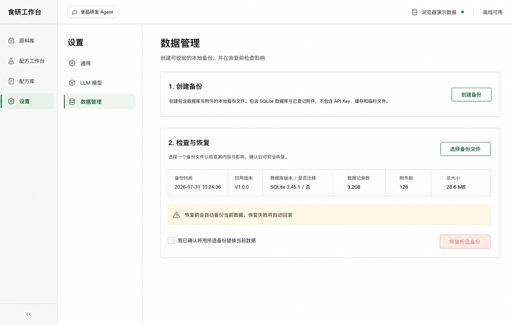

# 数据管理界面设计规格

状态：第五阶段实现基准
适用范围：Task 12
设计方向：在现有设置页中提供低频、可解释、不可误触的本机备份恢复流程

## 1. 设计基准

实现验收图：

- [桌面实现](./desktop-data-management-implementation.png)
- [600px 窄屏实现](./mobile-data-management-implementation.png)

概念图展示桌面版完成预检后的完整状态；实现图在浏览器演示模式拍摄，因此真实备份按钮禁用并显示边界说明。这是产品状态差异，不是缺失功能。

## 2. 产品原则

1. 备份与恢复仅在 Tauri 桌面版执行，浏览器演示不能伪装成功。
2. 页面使用“创建备份”与“检查并恢复”两步纵向流程，不引入定时备份、云同步或复杂策略。
3. 选择恢复文件后先只读预检；预检通过前不展示确认操作。
4. 只显示文件名，不在界面或错误中泄露本机绝对路径。
5. 恢复前必须勾选影响确认；前端和后端分别校验。
6. 恢复前自动创建当前数据安全副本，失败时自动回滚。
7. 成功恢复后重新打开共享数据连接，并刷新应用中的数据库状态、配方和标签视图。

## 3. 信息架构

设置侧栏增加“数据管理”，内容区包括：

- 页面说明：创建可校验的本地备份，并在恢复前检查内容、版本与影响。
- 浏览器模式说明：浏览器不执行真实本机备份。
- 步骤 1“创建备份”：说明纳入数据库和登记附件，排除 API Key、缓存和临时文件。
- 步骤 2“检查与恢复”：选择 `.foodrd-backup`，展示备份时间、应用版本、schema 迁移、记录数、附件数和总大小。
- 风险提示：恢复前自动备份当前数据，失败自动回滚。
- 明确确认：勾选“我已确认将用所选备份替换当前数据”后，恢复按钮才启用。
- 状态反馈：创建成功、预检通过、恢复成功或可操作错误。

## 4. 布局与视觉

- 延续设置页白色内容区、冷浅灰侧栏、绿色主色和现有字体 token。
- 内容宽度上限 900px；两个步骤使用轻边框开放区块，不做卡片仪表盘。
- 桌面摘要为六列；窄屏改为两列，再在手机宽度改为单列。
- 窄屏设置导航横向排列，操作按钮占满可用宽度。
- 禁用按钮必须呈现灰色弱化状态，不能与可点击按钮混淆。
- 恢复按钮使用低强度危险色；仅在确认后可点击。

## 5. 状态与可访问性

- 创建、检查和恢复共用忙碌锁，防止并发点击。
- 原生按钮使用真实 `disabled`，确认使用原生 `checkbox`。
- 成功反馈使用 `role="status"`，错误使用 `role="alert"`，浏览器边界使用 `role="note"`。
- 预检摘要使用 `dl/dt/dd`，标题与区域通过 `aria-labelledby` 关联。
- 文件选择取消不显示错误，也不改变已保存数据。

## 6. 不在本阶段范围

- 自动、定时或增量备份。
- 云端同步、跨设备同步和备份加密。
- 从浏览器 `localStorage` 生成桌面备份包。
- 在恢复界面选择性合并单个原料或配方。
