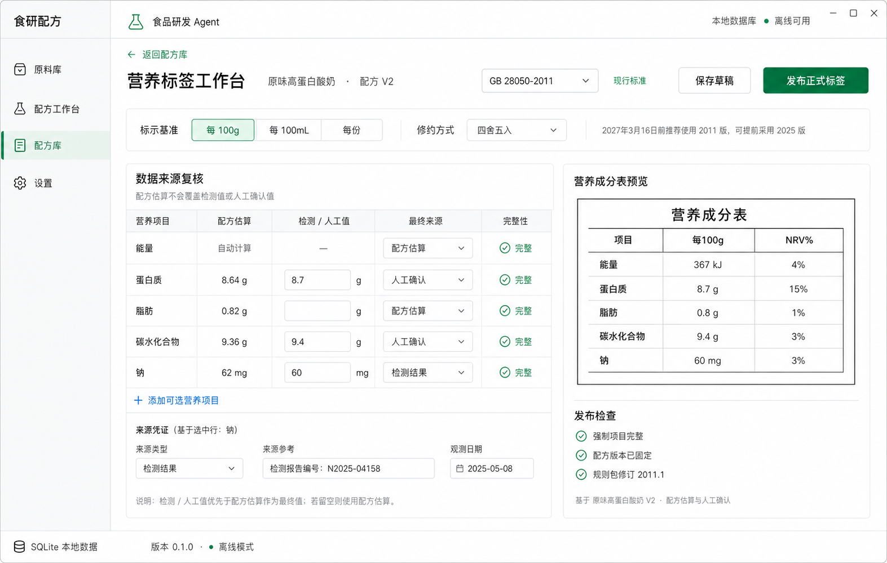
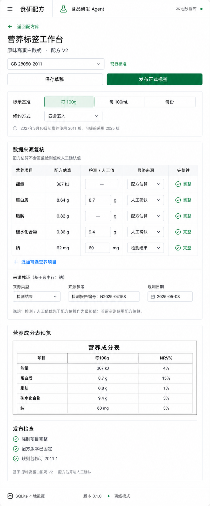

# 营养标签工作台设计规格

状态：第五阶段实现基准  
适用范围：Task 7  
设计方向：沿用食研配方白色 / 冷浅灰 / 绿色桌面研发工具；来源复核与中国营养成分表预览并列

## 1. 设计基准

### 桌面工作台

- 原始尺寸：1573 × 1000
- 用途：宽屏来源复核、标签预览和发布检查
- 实现中的规则、数据和文案以本规格为准；图片用于布局、密度、层级和视觉风格比对。

### 窄屏工作台

- 原始尺寸：809 × 1942
- 用途：窄窗口和移动宽度下的纵向来源复核、预览与发布检查
- 窄屏按“设置 → 来源复核 → 来源凭证 → 标签预览 → 发布检查”的顺序堆叠，不压缩成并排小栏。

## 2. 产品原则

1. 标签只能从明确的正式配方版本生成。
2. 用户必须能看见并确认 GB 28050 规则版本；日期只影响推荐，不自动改写选择。
3. 配方估算、检测结果和人工确认值分层显示，覆盖值不修改配方原始估算。
4. 未知值与确认零值必须在界面和持久化中保持区别。
5. 缺少强制项目时允许预览和保存草稿，但禁用正式发布并解释原因。
6. 正式发布由受信任路径重新计算；页面不提交客户端计算结果。
7. 这是研发工具，不加入营养声称、功能声称、营销信息、图表、KPI 或包装合规结论。

## 3. 色彩、字体与控件

沿用第四阶段 token，不新增第二套主题：

- 背景：纯白 `#ffffff`
- 侧栏：`#f6f8f7`
- 表头 / 次级表面：`#f5f7f6` / `#f8faf9`
- 文字：`#17211c`，次级 `#4f5d55`，辅助 `#78837d`
- 边界：`#d9e0dc`，强调边界 `#c4cec8`
- 主绿色：`#087a43`，柔和选中态 `#e9f4ee`
- 警告：`#b96a05`；错误：`#b42318`
- 字体：`"SF Pro Text", "PingFang SC", "Microsoft YaHei UI", system-ui, sans-serif`
- 页面标题：24px / 1.25 / 680
- 区域标题：16px / 1.35 / 650
- 正文、输入、按钮：14px / 1.5
- 表头与辅助文字：12–13px / 1.4–1.5
- 输入和按钮圆角 6px；主要分区 9px；普通区块不用阴影

## 4. 信息架构

### 标题区

- 返回操作：`返回配方库`
- 页面标题：`营养标签工作台`
- 配方上下文：`原味高蛋白酸奶 · 配方 V2`
- 规则选择：`GB 28050-2011` / `GB 28050-2025`
- 实施状态：`现行标准`、`可提前采用` 或 `已实施`
- 次操作：`保存草稿`
- 主操作：`发布正式标签`

发布后显示真实状态 `已发布 V1`，不使用装饰性徽章。

### 设置带

- `标示基准`：`每 100g` / `每 100mL` / `每份`
- `每份`选中时显示正数数量、单位和份量说明
- `修约方式`：`四舍五入` / `银行家舍入`
- 标准提示：
  - 2027-03-16 前：`2027年3月16日前推荐使用 2011 版，可提前采用 2025 版`
  - 2027-03-16 起：`新建标签推荐使用 GB 28050-2025`

### 数据来源复核

桌面列：

| 列 | 内容 |
| --- | --- |
| 营养项目 | 规则包项目名称 |
| 配方估算 | 正式配方版本冻结的每 100g 估算值 |
| 检测 / 人工值 | 仅在对应来源被选择时编辑 |
| 最终来源 | 配方估算 / 检测结果 / 人工确认 |
| 完整性 | 完整、部分、未知或错误 |

2011 基准行：能量、蛋白质、脂肪、碳水化合物、钠。  
2025 增加：饱和脂肪、糖。  
能量由供能营养素自动计算，不提供直接覆盖输入。  
操作：`+ 添加可选营养项目`，首批支持膳食纤维。

选中一行后显示来源凭证：

- 来源类型
- 来源参考
- 观测日期
- 说明：`检测 / 人工值优先于配方估算作为最终值；若留空则使用配方估算。`

### 标签预览

预览使用真实营养成分表结构：

- 标题 `营养成分表`
- 列：`项目`、当前基准、`NRV%`
- 行严格遵循所选规则包顺序
- 未规定 NRV 的项目显示 `—`
- 2025 版预览包含规定提示语
- 未知值显示 `未知`，不得显示为 `0`

### 发布检查

成功项：

- `强制项目完整`
- `配方版本已固定`
- `规则包修订 2011.1` 或 `2025.1`

问题项逐条使用结构化问题文案。存在错误时：

- 正式发布按钮禁用
- 区域顶部显示 `仍有 N 项问题`
- 保留保存草稿和预览能力

底部来源说明：`基于 {配方名} V{版本号} · {实际来源组合}`。

## 5. 布局

### 宽屏

- 工作台占满应用内容区并独立滚动。
- 标题区和设置带位于顶部。
- 主体两列：来源复核 `minmax(680px, 1.55fr)`；预览 `minmax(360px, 1fr)`。
- 两个区域只使用边界和开放分隔，不拆成指标卡。
- 标签预览保持打印表格比例，发布检查位于其下方。

### 窄屏

- `< 1040px` 主体改为单列。
- `< 760px` 标题、标准选择与操作分行；操作按钮并列且不遮挡内容。
- 来源表允许最小宽度横向滚动；在 `< 620px` 改为每项目分组行，避免隐藏字段。
- 标签预览位于来源凭证之后；状态栏保持现有应用规则。
- 所有可点击控件最小高度 40px。

## 6. 状态

- 初次进入：根据正式配方版本建立草稿初值。
- 读取中：`正在读取营养标签…`
- 预览计算中：保留上一结果，非阻塞显示 `正在重新计算…`
- 保存成功：`草稿已保存`
- 发布成功：`已发布正式标签 V{n}`
- 缺少正式配方版本：返回配方库并提示先保存正式配方版本。
- 存储或计算失败：显示可操作的中文错误，不泄露 SQL 或本地绝对路径。

## 7. 组件与状态边界

- `NutritionLabelWorkspace`：数据协调与页面组合
- `NutritionLabelHeader`：上下文、规则选择、保存和发布
- `NutritionLabelSettings`：标示基准、修约方式和日期提示
- `NutritionSourceTable`：来源值编辑与行选择
- `NutritionSourceEvidence`：来源参考与日期
- `NutritionFactsPreview`：确定性表格预览
- `NutritionPublishChecklist`：发布阻断和规则来源
- `nutrition-label-draft.ts`：从配方版本建立来源值、规则切换补行

`App` 只保存当前页面及选中的 recipe/version ID。独立读取并行执行，避免串行请求瀑布；计算输入用派生值，不通过 effect 冗余复制。

## 8. 图标

沿用现有 24 × 24、`stroke-width: 1.75`、round cap/join：

- 返回箭头
- 成功检查
- 警告
- 添加
- 保存
- 发布

所有图标按钮必须有 `aria-label`。返回、下拉和警告不使用纯文本字形代替可用图标。

## 9. 可访问性与交互

- 标准、基准和来源使用原生 `select` / `radio` 语义。
- 行选择与输入关联；错误使用 `aria-invalid` 和明确文本。
- 保存与发布结果使用 `aria-live="polite"`。
- 禁用发布时同时提供可读原因，不能只依赖颜色。
- 标签预览表使用真实 `table`、`caption`、`thead` 和 `tbody`。
- 焦点顺序：返回 → 标准 → 保存 / 发布 → 基准 → 来源表 → 来源凭证 → 预览 / 检查。
- `prefers-reduced-motion` 下关闭状态切换位移动画。

## 10. 实现与验收基准

必须验证：

1. 只能从正式配方版本进入。
2. 2011 与 2025 规则项目、顺序、提示语和实施状态正确。
3. 配方估算、检测结果、人工确认三种来源可切换且不覆盖原估算。
4. 未知和确认零值在编辑、保存、重启和发布后保持不同。
5. 缺少强制项目时可保存草稿但不能发布。
6. 保存后重开恢复；正式发布后出现不可变 V1/V2。
7. 桌面、窄屏和手机宽度无内容裁切或水平页面溢出。
8. 视觉与两张概念图在壳层、标题、设置带、表格、预览、颜色和密度上保持一致。
9. 没有新增营养声称、AI 结论、图表、营销卡或无关模块。

